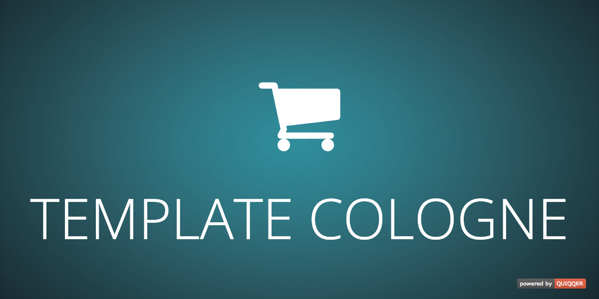

# QUIQQER Template Cologne



Template Cologne is a responsive e-commerce template for QUIQQER. It provides
shop-oriented page layouts, product and basket integrations, configurable
navigation, language and currency controls, and predefined footer content.

## Features

- Responsive layouts with optional left or right sidebars
- Product category, product detail, search, basket, and checkout templates
- Configurable main menu and product category menu
- Language and currency switching
- Brick areas for header, content, sidebar, and footer sections
- Optional predefined footer with legal links, featured products, and payments
- Smooth scrolling for page anchors

## Installation

Install the package through the QUIQQER package manager or Composer:

```shell
composer require quiqqer/template-cologne
```

Assign Template Cologne to the desired QUIQQER project and run the package
setup if the installation process has not done so automatically.

## Configuration

The template settings are available in the project administration. They cover
the logo, header and breadcrumb behavior, navigation, basket interaction,
checkout appearance, language and currency controls, and predefined footer.

Individual sites can override selected layout, header, title, description, and
menu settings through their site attributes.

## Smooth scrolling

Add `scrollToLink` to an anchor or button. The target can come from the link's
fragment or from `data-qui-target`; `data-qui-offset` defines an optional pixel
offset.

```html
<a class="scrollToLink" href="#contact" data-qui-offset="80">
    Contact us
</a>

<h2 id="contact">Contact</h2>
```

## Development

Initialize the package-local development tools and run all checks:

```shell
composer dev:init
composer test
```

The checks include PHPStan at level 8, PHPCS with PSR-12, and PHPUnit.

Template events are available around the main header, navigation, page, and
footer regions. Their names are defined in `index.html` and the partial
templates. Package-specific development notes are documented in
[`ECOMMERCE-dev.md`](ECOMMERCE-dev.md).

## Contributing

- [Source code](https://dev.quiqqer.com/quiqqer/template-cologne)
- [Issue tracker](https://dev.quiqqer.com/quiqqer/template-cologne/issues)

## License

GPL-3.0-or-later. See [`LICENSE`](LICENSE).

## Support

For support, contact [support@quiqqer.com](mailto:support@quiqqer.com).
